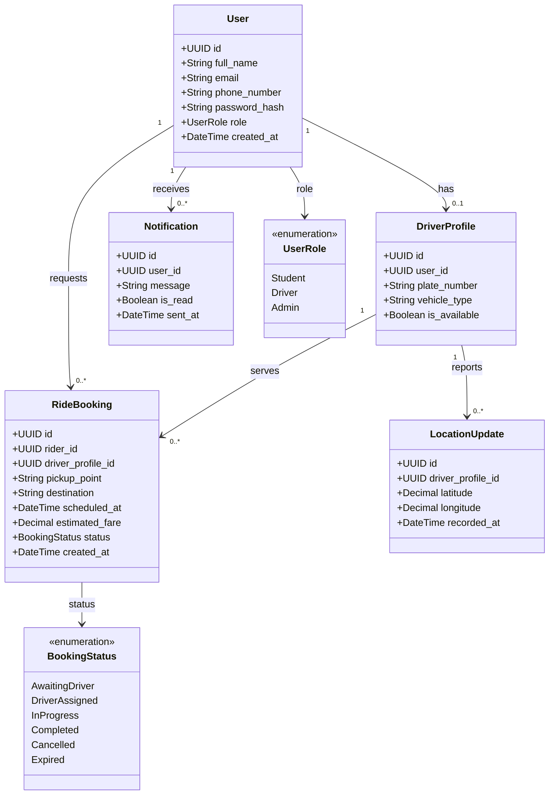

# Diagram 6 – Class Diagram: SRJ Student Ride Booking

```mermaid
classDiagram
    class User {
        +UUID id
        +String full_name
        +String email
        +String phone_number
        +String password_hash
        +UserRole role
        +DateTime created_at
    }

    class DriverProfile {
        +UUID id
        +UUID user_id
        +String plate_number
        +String vehicle_type
        +Boolean is_available
    }

    class RideBooking {
        +UUID id
        +UUID rider_id
        +UUID driver_profile_id
        +String pickup_point
        +String destination
        +DateTime scheduled_at
        +Decimal estimated_fare
        +BookingStatus status
        +DateTime created_at
    }

    class Notification {
        +UUID id
        +UUID user_id
        +String message
        +Boolean is_read
        +DateTime sent_at
    }

    class LocationUpdate {
        +UUID id
        +UUID driver_profile_id
        +Decimal latitude
        +Decimal longitude
        +DateTime recorded_at
    }

    class UserRole {
        <<enumeration>>
        Student
        Driver
        Admin
    }

    class BookingStatus {
        <<enumeration>>
        AwaitingDriver
        DriverAssigned
        InProgress
        Completed
        Cancelled
        Expired
    }

    User "1" --> "0..1" DriverProfile : has
    User "1" --> "0..*" RideBooking : requests
    User "1" --> "0..*" Notification : receives
    DriverProfile "1" --> "0..*" RideBooking : serves
    DriverProfile "1" --> "0..*" LocationUpdate : reports
    User --> UserRole : role
    RideBooking --> BookingStatus : status
```

