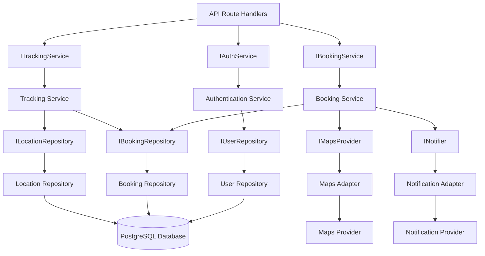

# Diagram 9 – UML Component Diagram: API Container

```mermaid
flowchart TB
    Routes["API Route Handlers"]

    Tracking["Tracking Service"]
    Auth["Authentication Service"]
    Booking["Booking Service"]

    ITracking["ITrackingService"]
    IAuth["IAuthService"]
    IBooking["IBookingService"]

    LocationRepo["Location Repository"]
    BookingRepo["Booking Repository"]
    UserRepo["User Repository"]

    ILocation["ILocationRepository"]
    IBookingRepo["IBookingRepository"]
    IUserRepo["IUserRepository"]

    MapsAdapter["Maps Adapter"]
    NotifyAdapter["Notification Adapter"]

    IMaps["IMapsProvider"]
    INotify["INotifier"]

    DB[("PostgreSQL Database")]
    Maps["Maps Provider"]
    Notify["Notification Provider"]

    Routes --> ITracking
    Routes --> IAuth
    Routes --> IBooking

    ITracking --> Tracking
    IAuth --> Auth
    IBooking --> Booking

    Tracking --> ILocation
    Tracking --> IBookingRepo
    Auth --> IUserRepo
    Booking --> IBookingRepo
    Booking --> IMaps
    Booking --> INotify

    ILocation --> LocationRepo
    IUserRepo --> UserRepo
    IMaps --> MapsAdapter
    INotify --> NotifyAdapter
    IBookingRepo --> BookingRepo

    LocationRepo --> DB
    BookingRepo --> DB
    UserRepo --> DB
    MapsAdapter --> Maps
    NotifyAdapter --> Notify
```

