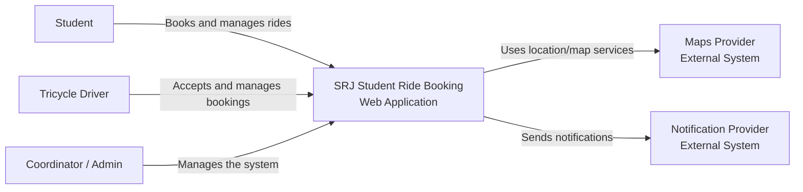

# C4 System Context Diagram

## SRJ Student Ride Booking

The SRJ Student Ride Booking is a ride-sharing web application designed for off-campus SORSU students.

### System Context

The system has three primary users:

* **Student** – uses the system to book and manage rides.
* **Tricycle Driver** – uses the system to receive and manage ride bookings.
* **Coordinator / Admin** – manages the system.

The system also interacts with two external systems:

* **Maps Provider** – provides map/location-related services.
* **Notification Provider** – handles system notifications.

**Note:** The system does not include an online payment system. Fare is paid in cash.
