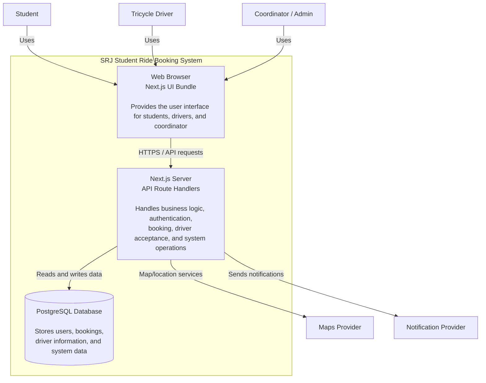

# C4 Container Diagram

## SRJ Student Ride Booking

The SRJ Student Ride Booking system is composed of a web interface, server-side application/API, and PostgreSQL database.

```mermaid
flowchart TB

    Student["Student"]
    Driver["Tricycle Driver"]
    Coordinator["Coordinator / Admin"]

    subgraph SRJ["SRJ Student Ride Booking System"]

        Browser["Web Browser<br/>Next.js UI Bundle<br/><br/>Provides the user interface for students, drivers, and coordinator"]

        API["Next.js Server<br/>API Route Handlers<br/><br/>Handles business logic, authentication,<br/>booking, driver acceptance, and system operations"]

        DB[("PostgreSQL Database<br/><br/>Stores users, bookings,<br/>driver information, and system data")]

    end

    Maps["Maps Provider"]
    Notification["Notification Provider"]

    Student -->|"Uses"| Browser
    Driver -->|"Uses"| Browser
    Coordinator -->|"Uses"| Browser

    Browser -->|"HTTPS / API requests"| API
    API -->|"Reads and writes data"| DB

    API -->|"Map/location services"| Maps
    API -->|"Sends notifications"| Notification
```

