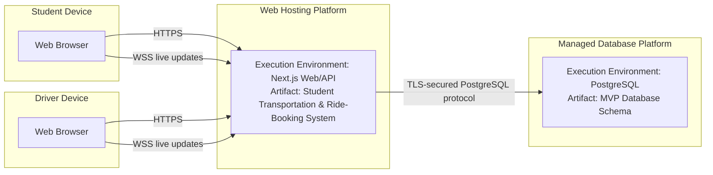

## Key
- **Device nodes** = student/driver client hardware.
- **Execution environment** = runtime hosting the application/database.
- **Artifact** = deployed software/schema.
- **HTTPS/WSS/TLS** = communication/security protocols.

### Important
This diagram is intentionally titled **Provisional** because the team has not specified an actual hosting vendor, domain, IP address, or final infrastructure configuration in the previous activities.

