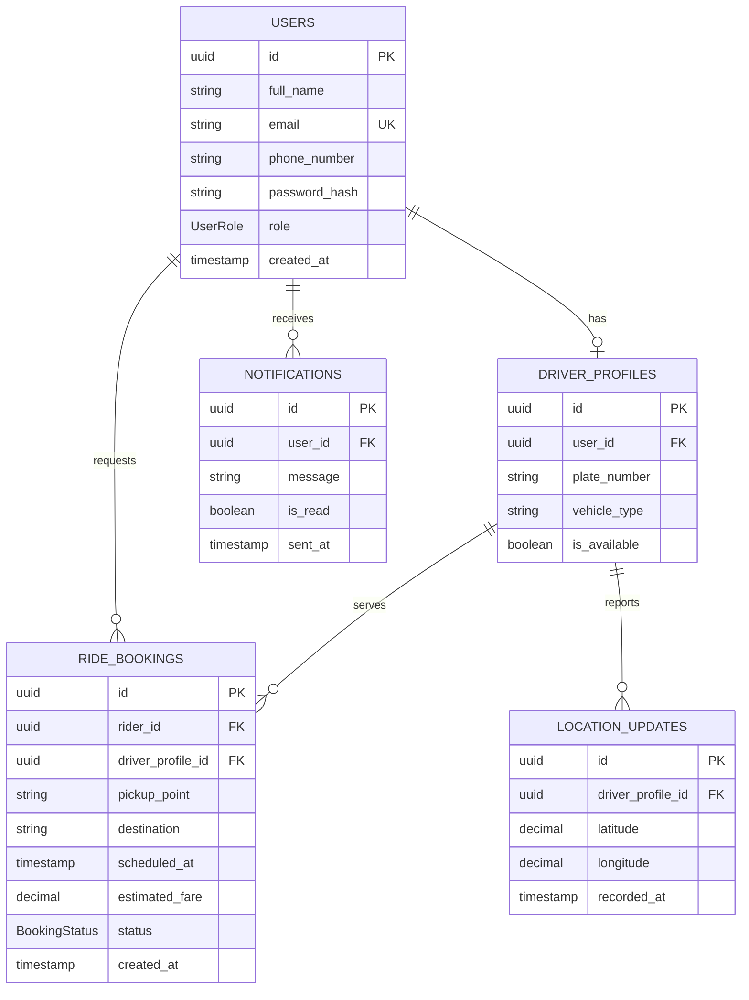

# Diagram 11 – Entity Relationship Diagram (DRAFT)

```mermaid
erDiagram
    USERS {
        uuid id PK
        string full_name
        string email UK
        string phone_number
        string password_hash
        UserRole role
        timestamp created_at
    }

    DRIVER_PROFILES {
        uuid id PK
        uuid user_id FK
        string plate_number
        string vehicle_type
        boolean is_available
    }

    RIDE_BOOKINGS {
        uuid id PK
        uuid rider_id FK
        uuid driver_profile_id FK
        string pickup_point
        string destination
        timestamp scheduled_at
        decimal estimated_fare
        BookingStatus status
        timestamp created_at
    }

    NOTIFICATIONS {
        uuid id PK
        uuid user_id FK
        string message
        boolean is_read
        timestamp sent_at
    }

    LOCATION_UPDATES {
        uuid id PK
        uuid driver_profile_id FK
        decimal latitude
        decimal longitude
        timestamp recorded_at
    }

    USERS ||--o| DRIVER_PROFILES : has
    USERS ||--o{ RIDE_BOOKINGS : requests
    USERS ||--o{ NOTIFICATIONS : receives
    DRIVER_PROFILES ||--o{ RIDE_BOOKINGS : serves
    DRIVER_PROFILES ||--o{ LOCATION_UPDATES : reports
```

**DRAFT:** Personal-information fields from the source model include name, email, phone, plate number, pickup point, latitude, and longitude.

