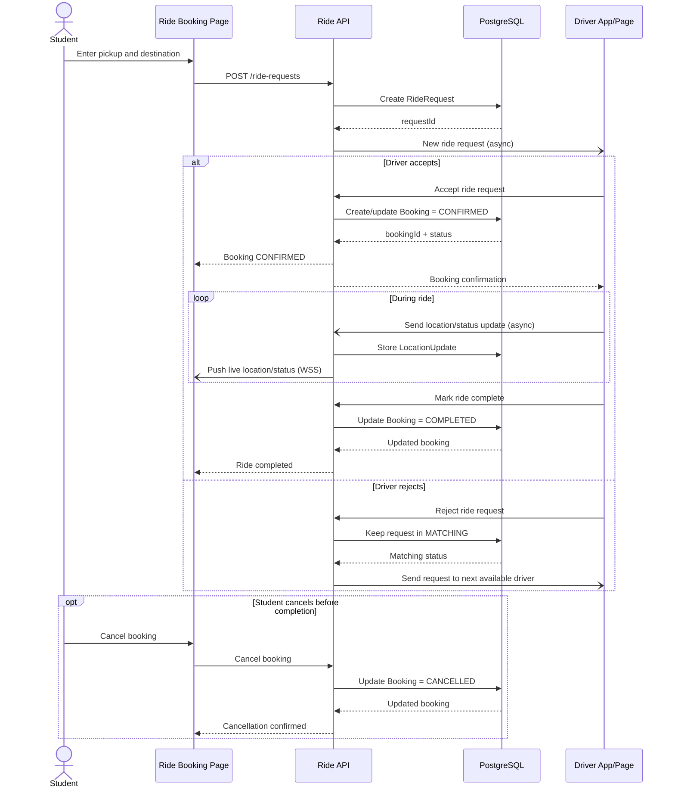

```mermaid
sequenceDiagram
    actor S as Student
    participant P as Ride Booking Page
    participant API as Ride API
    participant DB as PostgreSQL
    participant D as Driver App/Page

    S->>P: Enter pickup and destination
    P->>API: POST /ride-requests
    API->>DB: Create RideRequest
    DB-->>API: requestId

    API-)D: New ride request (async)

    alt Driver accepts
        D->>API: Accept ride request
        API->>DB: Create/update Booking = CONFIRMED
        DB-->>API: bookingId + status
        API-->>P: Booking CONFIRMED
        API-->>D: Booking confirmation

        loop During ride
            D-)API: Send location/status update (async)
            API->>DB: Store LocationUpdate
            API-)P: Push live location/status (WSS)
        end

        D->>API: Mark ride complete
        API->>DB: Update Booking = COMPLETED
        DB-->>API: Updated booking
        API-->>P: Ride completed
    else Driver rejects
        D->>API: Reject ride request
        API->>DB: Keep request in MATCHING
        DB-->>API: Matching status
        API-)D: Send request to next available driver
    end

    opt Student cancels before completion
        S->>P: Cancel booking
        P->>API: Cancel booking
        API->>DB: Update Booking = CANCELLED
        DB-->>API: Updated booking
        API-->>P: Cancellation confirmed
    end
```
